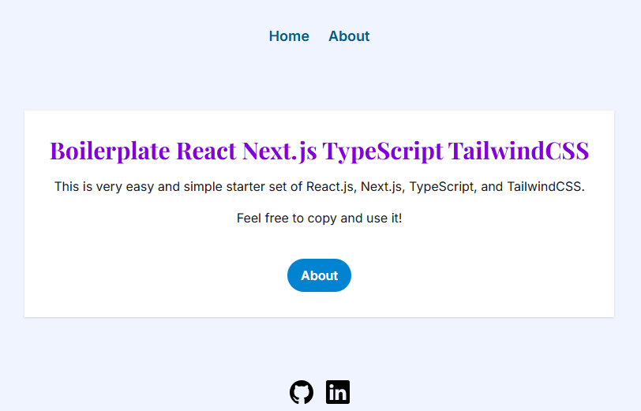

# Welcome to My Portfolio!

Hi! This is Yoko, Frontend Developer. Take a look at my recent work.

## Screenshot

 

## Demo

Deployed to Vercel, [here](https://yoko-portfolio.vercel.app)

## Features

- React 18 / Next.js App Router
- TypeScript support
- TailwindCSS, including dark mode support
- Google Fonts with CSS variables (`--font-title`, `--font-text`)
- Layout component with `<Header />` and `<Footer />`
- UI component with `<Button />`
- Easily customizable styles using CSS variables and Tailwind classes
- Dynamic site configuration with `src/app/constants/site.ts`
- 404 page
- Dark mode setting
- Sitemap and robots.txt for SEO.
- Minimal GitHub Actions workflow that runs `npm run lint` automatically on each push and pull request to the `main` branch. 

## Getting Started

First, clone the repository:

```bash
git clone https://github.com/kizuyoko/boilerplate-react-nextjs-typescript-tailwind.git
cd boilerplate-react-nextjs-typescript-tailwind
```
Then, install dependencies and start the development server:

```bash
npm install
npm run dev
# or
yarn
yarn dev
# or
pnpm dev
# or
bun dev
```

Open [http://localhost:3000](http://localhost:3000)  in your browser to see the app running.

You can start editing the page by modifying `app/page.tsx`. The page auto-updates as you edit the file.

## Otherwise, create Your Own From Scratch

To build a similar setup manually, run:

```bash
npx create-next-app@latest nameOfYourApp --typescript
```

Then I got such quiestions and I answered Yes to the first 4, No to the last 2:

```bash
√ Would you like to use ESLint? ... No / Yes
√ Would you like to use Tailwind CSS? ... No / Yes
√ Would you like your code inside a `src/` directory? ... No / Yes
√ Would you like to use App Router? (recommended) ... No / Yes
√ Would you like to use Turbopack for `next dev`? ... No / Yes
√ Would you like to customize the import alias (`@/*` by default)? ... No / Yes
```

Once installed, follow the generated README or use this one for guidance.

