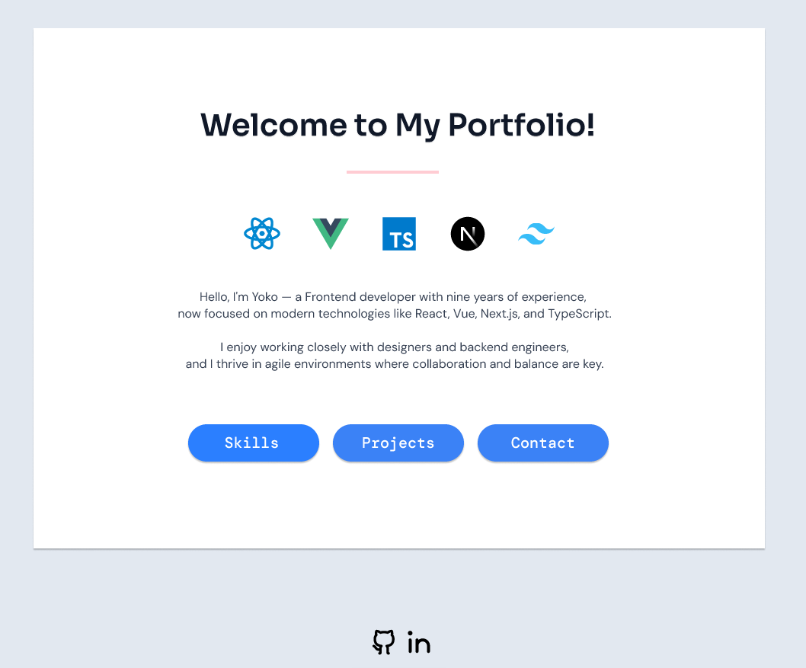

# Welcome to My Portfolio!

Hi! This is Yoko, a Frontend Developer.

This portfolio site has been completely rebuilt from scratch to reflect my recent growth in modern frontend technologies including React, Next.js, and TypeScript.  

You can still view my previous portfolio [here](https://portfolioyoko.vercel.app) to see how far I’ve come.

Feel free to explore my updated work — and check back soon for further improvements!

This site was created using my custom [boilerplate](https://boilerplate-react-nextjs-typescript.vercel.app/). You're welcome to clone it and use it as a starting point for your own projects!

## Improvements from the last version
- Design from scratch with [Figma](https://www.figma.com/design/jawKCOfRFJjaRytr5RtJDm/Yoko-Portfolio?node-id=63-38&t=e8XsOdkiLwFETs5y-1)
- Improved page structure with Next.js routing and better performance
- Categorized skills section for easier readability
- Project section with more detailed descriptions
- More complex responsive design, now that the number of pages has increased
- Documentation in README.md and feature branches per pages while development

## Screenshot

 

## Deployment

Live on Vercel, [View Site](https://yoko-portfolio-kappa.vercel.app/)

## Features

- Fully designed in [Figma](https://www.figma.com/design/jawKCOfRFJjaRytr5RtJDm/Yoko-Portfolio?node-id=63-38&t=e8XsOdkiLwFETs5y-1)
- Built with React 18 and Next.js App Router
- Written in TypeScript
- Tailwind CSS setup with responsive and dark mode support
- Dynamic site settings stored in `src/app/constants/site.ts`
- Custom 404 page
- Dark mode
- SEO-ready with sitemap.xml and robots.txt
- Minimal GitHub Actions workflow that runs `npm run lint` automatically on each push and pull request to the `main` branch. 

## Tech Stack

- **Frameworks**: React, Next.js
- **Languages**: TypeScript
- **Styling**: Tailwind CSS
- **Design**: Figma
- **Deployment**: Vercel
- **CI/CD**: GitHub Actions

## GitHub Branches
- setup
- layout
- feature/home
- feature/skills
- feature/projects
- feature/contact
- enhancement/responsive
- theme/dark-mode

## Getting Started

First, clone the repository:

```bash
git clone https://github.com/kizuyoko/boilerplate-react-nextjs-typescript-tailwind.git
cd boilerplate-react-nextjs-typescript-tailwind
```
Then, install dependencies and start the development server:

```bash
npm install
npm run dev
# or
yarn
yarn dev
# or
pnpm dev
# or
bun dev
```

Open [http://localhost:3000](http://localhost:3000)  in your browser to see the app running.

You can start editing the page by modifying `app/page.tsx`. The page auto-updates as you edit the file.

